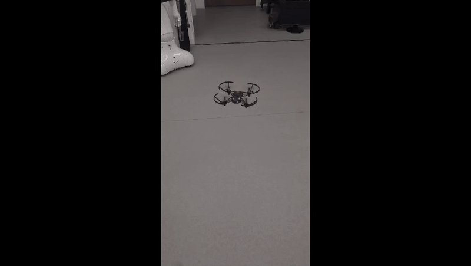

# Rapport de Projet : Pilotage et Autonomie sur Drone Tello (ROS2)

**Auteurs :** Alix DEGIRONDE & Pao DELORME  
**Cadre :** TP Robotique Mobile & ROS2  
**Date :** Novembre 2025

---

## Table des Matières
- [Rapport de Projet : Pilotage et Autonomie sur Drone Tello (ROS2)](#rapport-de-projet--pilotage-et-autonomie-sur-drone-tello-ros2)
  - [Table des Matières](#table-des-matières)
  - [1. Introduction](#1-introduction)
    - [1.1 Contexte et Objectifs](#11-contexte-et-objectifs)
    - [1.2 Théorie : Mécanique du vol d'un quadrirotor](#12-théorie--mécanique-du-vol-dun-quadrirotor)
  - [2. Installation et Configuration](#2-installation-et-configuration)
    - [2.1 Configuration de l'environnement](#21-configuration-de-lenvironnement)
    - [2.2 Organisation du Workspace](#22-organisation-du-workspace)
    - [2.3 Visualisation et Validation](#23-visualisation-et-validation)
  - [3. Architecture Globale du Système](#3-architecture-globale-du-système)
    - [3.1 Évolution de l'Architecture](#31-évolution-de-larchitecture)
    - [3.2 Le Multiplexeur tello\_behaviour](#32-le-multiplexeur-tello_behaviour)
    - [3.3 Système de Topics et Communication](#33-système-de-topics-et-communication)
    - [3.4 Stratégie de Remapping](#34-stratégie-de-remapping)
  - [4. Modes de Vol : Implémentation et Communication](#4-modes-de-vol--implémentation-et-communication)
    - [4.1 Mode Manuel](#41-mode-manuel)
    - [4.2 Mode Surveillance](#42-mode-surveillance)
    - [4.3 Mode Spielberg](#43-mode-spielberg)
    - [4.4 Mode QR Follower](#44-mode-qr-follower)
    - [4.5 QR Code Reader : changement de mode via QR](#45-qr-code-reader--changement-de-mode-via-qr)
  - [5. Structure du Projet](#5-structure-du-projet)
    - [5.1 Architecture des Packages](#51-architecture-des-packages)
  - [6. Lancement du Système](#6-lancement-du-système)
  - [7. Conclusion](#7-conclusion)

---

## 1. Introduction

Ce projet vise à développer une architecture logicielle complète sous **ROS2** pour contrôler un drone **Tello**, en permettant à l'utilisateur différents modes de contrôle du drone.

### 1.1 Contexte et Objectifs

Ce projet s'articule autour de trois axes principaux :

- **Maîtrise de ROS2** : Communication inter-nœuds, services, actions
- **Vision par ordinateur** : Détection et suivi de QR codes avec OpenCV
- **Autonomie** : Gestion de modes automatiques et différents scénarios

### 1.2 Théorie : Mécanique du vol d'un quadrirotor

Pour contrôler la trajectoire d'un quadrirotor, on agit sur la vitesse de rotation des 4 hélices pour créer des différentiels de poussée. Voici les 4 commandes classiques :

1. **Gaz (Throttle)** : Monter/Descendre. On augmente ou diminue la vitesse des 4 moteurs simultanément pour créer une variation de poussée verticale.

2. **Lacet (Yaw)** : Rotation sur soi-même autour de l'axe Z. On accélère les moteurs tournant dans un sens (horaire) et on ralentit les autres pour créer un couple de rotation.

3. **Tangage (Pitch)** : Avancer/Reculer. On accélère les moteurs arrière et ralentit les moteurs avant, créant une inclinaison du drone vers l'avant ou l'arrière.

4. **Roulis (Roll)** : Déplacement latéral gauche/droite. On accélère les moteurs d'un côté et ralentit ceux de l'autre pour incliner le drone latéralement.

---

## 2. Installation et Configuration

### 2.1 Configuration de l'environnement

Nous avons utilisé un workspace ROS2 complet avec la structure suivante :

```
tello/
├── workspace/
│   ├── src/
│   │   ├── controller/        # Notre package principal (développé)
│   │   ├── tello/             # Driver Tello
│   │   ├── tello_control/     # Contrôle manuel alternatif
│   │   └── tello_msg/         # Messages et services personnalisés
│   ├── build/
│   ├── install/
│   └── log/
```

Les dépendances Python ont été gérées via un environnement virtuel (`venv`) incluant :
- `rclpy` (ROS2 Python)
- `opencv-python` (vision)
- `cv_bridge` (conversion ROS ↔ OpenCV)

### 2.2 Organisation du Workspace

> **Question du TP :** L'organisation du dossier cloné ne semble pas correspondre à ce que les standards ROS2 imposent... À moins que ?

La bonne pratique ROS2 veut qu'on clone uniquement un package dans le `/src` de notre workspace. Or, dans ce cas, le clone du git contient tout un projet, avec notamment un workspace complet.

Nous avons donc travaillé directement dans le workspace fourni (`tello/workspace`) au lieu de créer un nouveau workspace. Cette organisation, bien que non conventionnelle, est justifiée car :

- Le projet fournit plusieurs packages interdépendants (`controller`, `tello`, `tello_control`, `tello_msg`)
- La structure facilite le partage d'un environnement complet et fonctionnel
- Les dépendances et configurations sont déjà intégrées

### 2.3 Visualisation et Validation

Nous avons utilisé **RViz2** et **rqt** pour valider le bon fonctionnement du système :


*Figure 1 : Interface rqt_graph montrant l'architecture complète des nœuds ROS2*


**Capteur Time-of-Flight (ToF) :**  
Le topic `/status` contient un champ `distance_tof` qui fournit l'altitude précise du drone en centimètres. Ce capteur est crucial pour le vol stationnaire et les manœuvres automatiques. Une implémentation a été faite pour autoriser ou non au drone certaines actions en fonction de l'altitude de ce dernier (ex: ne pas pouvoir décoller si distance au sol > 30 cm). Cela été permis en écoutant le topic `/status`, mais ce dernier posait des problèmes de connexion avec le drone.

Le champ Wi‑Fi du topic `/status` est obtenu en envoyant la commande "wifi?" au drone et en lisant la réponse (ex. `90`), comme montré dans les logs :

```
[INFO] tello.py - 438 - Send command: 'wifi?'
[INFO] tello.py - 471 - Send command (no response expected): 'rc 0 0 0 0'
[INFO] tello.py - 462 - Response wifi?: '90'
```

Lors de l'envoi simultané d'autres commandes (ex. décollage) ou en cas de batterie faible, le drone peut ne pas répondre à la requête "wifi?", la tentative de lecture échoue et provoque le crash du nœud `tello`.

```bash
# Visualiser l'altitude en temps réel
ros2 topic echo /status
```


       
```python
 self.subscription_status = self.create_subscription(TelloStatus, '/status', self.status_callback, 10)
 def status_callback(self, msg: TelloStatus):
       altitude = msg.distance_tof
       self.get_logger().info(f"Statut du drone reçu: Altitude à {altitude} cm")
       if altitude < 30 :
           self.altitude_condition = 1
       else:
           self.altitude_condition = 0
```


---

## 3. Architecture Globale du Système

### 3.1 Évolution de l'Architecture

Pour gérer la complexité des différents modes (Manuel, Automatique, Urgence), nous avons fait évoluer l'architecture simple vers une architecture centralisée avec filtrage de certaines commandes en fonction du mode choisi.

**Architecture initiale** (simple mais non sécurisée) :

```
[Joystick] → [manual_control] → [/control] → [Tello Driver] → [Drone]
```

**Architecture finale** (avec multiplexeur de comportement) :

```
[Joystick] → [manual_control] → [/control/*] → [tello_behaviour] → [/control, /takeoff, /land] → [Drone]
                                                       ↑
                                                [Service /drone_mode]
                                                       ↓
                                    [Modes: surveillance, spielberg, qr_follower]
```

### 3.2 Le Multiplexeur tello_behaviour

Le nœud **`tello_behaviour`** est le cerveau du système. Il agit comme un **multiplexeur de commandes** avec filtrage selon le mode actif.

**Fonctionnalités clés :**

- **Gestion de 4 modes de vol** : Manuel, QR Follower, Spielberg, Surveillance
- **Filtrage sélectif** : En mode automatique, seuls les commandes critiques (emergency, takeoff, land) du joystick passent
- **Service ROS2** : Changement de mode à la volée via `/drone_mode`
- **Sécurité** : Prévention des conflits entre commandes manuelles et automatiques

Le nœud expose un service `/drone_mode` qui permet de basculer entre les différents modes :

```bash
# Changer de mode via service ROS2
ros2 service call /drone_mode tello_msg/srv/DroneMode "{mode: 2}"
```

### 3.3 Système de Topics et Communication

**Topics du contrôle manuel** (avant filtrage par `tello_behaviour`) :
| Topic | Type | Description |
|-------|------|-------------|
| `/control/takeoff` | `std_msgs/Empty` | Décollage manuel |
| `/control/land` | `std_msgs/Empty` | Atterrissage manuel |
| `/control/emergency` | `std_msgs/Empty` | Arrêt d'urgence (toujours prioritaire) |
| `/control/cmd_vel` | `geometry_msgs/Twist` | Mouvements joystick (bloqués en mode auto) |
| `/control/flip` | `std_msgs/String` | Figures acrobatiques (mode manuel uniquement) |

**Topics vers le drone** (après filtrage) :

| Topic | Type | Description |
|-------|------|-------------|
| `/control` | `geometry_msgs/Twist` | Commande de vitesse 3D + rotation |
| `/takeoff` | `std_msgs/Empty` | Décollage effectif |
| `/land` | `std_msgs/Empty` | Atterrissage effectif |
| `/emergency` | `std_msgs/Empty` | Arrêt effectif |

**Topics de retour drone :**

| Topic | Type | Description |
|-------|------|-------------|
| `/image_raw` | `sensor_msgs/Image` | Flux vidéo caméra frontale |
| `/status` | `tello_msgs/TelloStatus` | Batterie, altitude (ToF), temps de vol |
| `/odom` | `nav_msgs/Odometry` | Estimation position/orientation |
| `/imu` | `sensor_msgs/Imu` | Accéléromètre + gyroscope |

### 3.4 Stratégie de Remapping

> **Question du TP :** Vous remarquerez que le topic sortant de `manual_control` a changé. Comment avons-nous procédé ? Quel est l'intérêt ? Pourquoi effectuer le changement en sortie de joy est intéressant plutôt qu'ailleurs ?

Nous avons renommé les topics de sortie de `manual_control` pour ajouter le préfixe `/control/*`. 

Dans le code de `manual_control.py`, nous publions sur des topics préfixés :

```python
self.pub_takeoff = self.create_publisher(Empty, '/control/takeoff', 10)
self.pub_land = self.create_publisher(Empty, '/control/land', 10)
self.pub_cmd_vel = self.create_publisher(Twist, '/control/cmd_vel', 10)
```
Les intérêts majeurs résident dans la séparation claire des responsabilités : les commandes du joystick (/control/*) sont distinctes des commandes validées envoyées au drone (/takeoff, /land, etc.), ce qui permet au nœud tello_behaviour de servir de point d'interception unique en s'abonnant à tous les /control/ et en décidant de les relayer ou non selon le mode actif. Cette architecture renforce la sécurité en empêchant qu'un nœud défaillant ou malveillant publie directement sur /takeoff sans passer par le filtre, améliore la traçabilité des commandes (origine joystick vs mode automatique) et offre une grande flexibilité pour ajouter d'autres sources de commandes (clavier, API web, etc.) publiant elles aussi sur /control/.

**Pourquoi après `joy` plutôt qu'ailleurs ?**  
Le nœud `joy` publie des données brutes de joystick (`sensor_msgs/Joy`). C'est `manual_control` qui interprète ces données et les convertit en commandes sémantiques (Twist, Empty). Effectuer le remapping à cette étape est logique car on dispose déjà de messages typés et compréhensibles, on peut appliquer des transformations (dead zones, scaling) et on conserve la flexibilité de changer la source d'entrée (autre joystick, clavier) sans modifier l'architecture downstream.

---

## 4. Modes de Vol : Implémentation et Communication

Le système propose 4 modes de vol distincts, chacun avec sa propre implémentation et son mécanisme de communication adapté.

### 4.1 Mode Manuel

Mode par défaut. Le pilote a un contrôle total via le joystick Xbox :

**Mappage des boutons :**

- **Stick Droit** : Gaz (haut/bas) + Lacet (rotation)
- **Stick Gauche** : Tangage (avant/arrière) + Roulis (gauche/droite)
- **Bouton A** : Décollage
- **Bouton B** : Atterrissage
- **Bouton XBOX** : Arrêt d'urgence
- **Bouton Y** : Flip avant
- **Bouton X** : Flip arrière
- **Bouton L1** : Flip gauche
- **Bouton R1** : Flip droit

**Flux de communication :**

```
[Joy Node] → [manual_control] → [/control/*] → [tello_behaviour] → [/control] → [Drone]
```


*Figure 2 : Mode Manuel - On côntrole le drone comme bon nous semble avec les différentes commandes possibles*

### 4.2 Mode Surveillance

Ce mode effectue une rotation panoramique continue pour surveiller l'environnement à 360 degrés.

**Pourquoi un Service ?**

Le mode Surveillance a été implémenté avec un service ROS2 (`tello_msg/srv/Surveillance`) car l'action demandée est un changement d'état binaire (activer/désactiver) qui nécessite une confirmation synchrone immédiate.

**Type de Service :**

```
# Request
bool data    # true = activer, false = désactiver
---
# Response
bool success
```


**Implémentation :**

```python
class Surveillance(Node):
    def __init__(self):
        # Timer à 20 Hz pour commandes fluides
        self.timer = self.create_timer(0.05, self.timer_callback)
        
        # Service pour activer/désactiver
        self.surveillance_service = self.create_service(
            SurveillanceSrv,
            '/surveillance/control',
            self.handle_surveillance_request
        )
    
    def timer_callback(self):
        if self.is_active:
            twist = Twist()
            twist.angular.z = 100.0  # Rotation continue
            self.cmd_vel_pub.publish(twist)
```

**Fonctionnement :**

1. **Activation** : Le nœud surveillance bascule son flag interne `is_active` et renvoie un accusé de réception
2. **Génération de commandes** : Quand `is_active == True`, le nœud publie à 20 Hz des messages `Twist` sur `/surveillance/cmd_vel`
3. **Intégration avec tello_behaviour** : `tello_behaviour` s'abonne à `/surveillance/cmd_vel` et, si le mode courant est Surveillance, relaie ces commandes vers `/control`
4. **Désactivation** : Le nœud envoie une commande d'arrêt (Twist nul) pour sécuriser la fin de la rotation



*Figure 3 : Mode surveillance - Le drone effectue une rotation panoramique continue à vitesse constante*

### 4.3 Mode Spielberg

Le mode Spielberg exécute une séquence cinématique pré-programmée : avance, rotation, recul - comme un travelling cinématographique.

**Pourquoi une Action ?**

Le mode Spielberg a été implémenté avec une Action ROS2 (`tello_msg/action/Spielberg`) car la séquence est composée d'étapes ordonnées exécutées sur plusieurs secondes, avec besoin de remontée de progression et possibilité d'annulation.

**Avantages d'une Action pour Spielberg :**

- **Exécution asynchrone** (non bloquante) pour le nœud appelant
- **Feedback périodique** (étape en cours / temps écoulé) pour monitoring et logs
- **Possibilité d'annulation propre** (`cancel_goal`) à tout moment
- **Gestion explicite** d'acceptation/rejet du goal (validation avant exécution)

**Structure de l'Action :**

```
# Goal - Démarrer la séquence
bool start
---
# Result - Résultat final
bool success
string message
---
# Feedback - Progression en temps réel
int32 current_step
int32 total_steps
float32 elapsed_time
```

**Séquence d'exécution :**

1. **Étape 1/3** : Avancement (twist.linear.y = 50.0) pendant 2s
2. **Étape 2/3** : Rotation caméra (twist.angular.z = 40.0) pendant 1s
3. **Étape 3/3** : Recul (twist.linear.y = -50.0) pendant 2s
4. Arrêt et publication du résultat

**Workflow de Communication :**

```
1. Utilisateur : ros2 service call /drone_mode "{mode: 2}"
         ↓
2. [tello_behaviour] : Reçoit requête DroneMode
         ↓
3. [tello_behaviour] : Arrête mode actuel (si nécessaire)
         ↓
4. [tello_behaviour] : Change current_mode = SPIELBERG
         ↓
5. [tello_behaviour] : Envoie Goal à Action Server spielberg
         ↓
6. [spielberg] : Accepte le Goal
         ↓
7. [spielberg] : Exécute séquence (avance → rotation → recul)
         │
         ├─> Feedback après chaque étape
         │   (reçu par tello_behaviour et loggé)
         │
8. [spielberg] : Publie Result (success=true)
         ↓
9. [tello_behaviour] : Reçoit Result et affiche confirmation
```

**Gestion de l'annulation :**

```python
def execute_callback(self, goal_handle):
    # Après chaque étape, vérifier l'annulation
    if goal_handle.is_cancel_requested:
        self.send_stop_command()
        goal_handle.canceled()
        result.success = False
        result.message = "Séquence annulée"
        return result
```


*Figure 4 : Logs du mode Spielberg montrant les étapes et le feedback temps réel*


*Figure 5 : Vue embarquée pendant la séquence cinématique Spielberg*


*Figure 6 : Travelling Spielberg complet (avance, rotation, recul)*

### 4.4 Mode QR Follower

Le mode QR Follower implémente un asservissement visuel pour suivre et centrer un QR code dans le champ de vision du drone.

**Chaîne de traitement :**

```
[/image_raw] → [cv_bridge] → [OpenCV Image] → [QRCodeDetector] → [Position & Data] → [Commandes Twist]
```

**Technologies utilisées :**

- `cv_bridge` : Conversion ROS Image ↔ OpenCV
- `cv2.QRCodeDetector()` : Détection native OpenCV (rapide, pas besoin de bibliothèques externes)
- Calcul de position 2D basé sur la bounding box du QR code

**Algorithme de contrôle :**

```python
# 1. Détection du QR code et calcul du centre
qr_center_x, qr_center_y = get_qr_center(bbox)

# 2. Calcul de l'erreur par rapport au centre de l'image
error_x = qr_center_x - (img_width / 2)
error_y = qr_center_y - (img_height / 2)

# 3. Génération des commandes (zones de tolérance)
if qr_center_x < center - zone/2:
    twist.linear.x = -30.0  # Déplacement gauche
elif qr_center_x > center + zone/2:
    twist.linear.x = 30.0   # Déplacement droite
```

**Zone morte (Dead Zone) :**  
Pour éviter les oscillations, nous avons défini une zone de tolérance (1/3 de l'image) autour du centre. Le drone ne bouge que si le QR code sort de cette zone.


*Figure 7 : Le drone suit automatiquement le QR code et se stabilise quand il est centré*

**Défis rencontrés :**

- **Latence WiFi** : Le flux vidéo a ~200ms de délai, nécessitant des gains conservateurs
- **Stabilité** : Sans zone morte, le drone oscillait continuellement
- **Luminosité** : La détection OpenCV est sensible aux conditions d'éclairage

Pour surmonter ces défis et permettre la stabilisation du drone lorsque le QR code est au centre de l'image, nous avons dû simplifier la manière dont le drone suit le QR code avec une commande simple sur ses différents axes.

### 4.5 QR Code Reader : changement de mode via QR

Le nœud `qr_code_reader` permet de changer de mode en détectant des QR codes spécifiques. Il s'abonne au flux vidéo `/image_raw`, détecte les QR codes via OpenCV et appelle le service `/drone_mode` pour basculer entre les modes selon le contenu lu.

```python
class QRCodeReader(Node):
    def __init__(self):
        self.available_mode = {'manual_control':0, 'qr_code_follower':1, 
                               'spielberg':2, 'surveillance':3}
        self.subscription = self.create_subscription(Image, '/image_raw', 
                                                      self.qr_callback, 10)
        self.mode_client = self.create_client(DroneMode, '/drone_mode')
    
    def qr_callback(self, msg):
        data, bbox, _ = self.qr_detector.detectAndDecode(cv_image)
        if data in self.available_mode and self.available_mode[data] != self.current_mode:
            request = DroneMode.Request()
            request.mode = self.available_mode[data]
            self.mode_client.call_async(request)
```
---

## 5. Structure du Projet

### 5.1 Architecture des Packages

Le workspace contient 4 packages principaux :

**1. Package `controller` (Python)**
- **Rôle** : Logique de contrôle manuel et modes automatiques, filtrage des commandes
- **Nœuds** : 6 nœuds (manual_control, tello_behaviour, spielberg, surveillance, qr_code_follower, qr_code_reader)
- **Dépendances** : rclpy, geometry_msgs, sensor_msgs, cv_bridge, opencv-python

```
controller/
├── controller/
│   ├── __init__.py
│   ├── manual_control.py          # Pilotage joystick
│   ├── tello_behaviour.py         # Multiplexeur de modes
│   ├── qr_code_follower.py        # Suivi de QR code
│   ├── qr_code_reader.py          # Lecteur QR simple
│   ├── spielberg.py               # Action server cinématique
│   └── surveillance.py            # Mode surveillance
├── setup.py
└── package.xml
```

**2. Package `tello` (Python)**
- **Rôle** : Driver matériel, interface avec la bibliothèque `djitellopy`, gestion de la connexion WiFi au drone
- **Nœud principal** : `tello` (node.py)
- **Publications** :
  - `/image_raw` : sensor_msgs/Image (flux vidéo 30 FPS)
  - `/camera_info` : sensor_msgs/CameraInfo
  - `/status` : tello_msg/TelloStatus (batterie, altitude ToF, température)
  - `/imu` : sensor_msgs/Imu (accéléromètre, gyroscope)
  - `/odom` : nav_msgs/Odometry
  - `/battery` : sensor_msgs/BatteryState
- **Souscriptions** :
  - `/takeoff`, `/land`, `/emergency` : std_msgs/Empty
  - `/control` : geometry_msgs/Twist
  - `/flip` : std_msgs/String


**3. Package `tello_msg` (Messages/Services personnalisés)**
- **Rôle** : Définitions de messages et services custom pour le projet
- **Types définis** :
  - **Messages** : `TelloStatus.msg`, `TelloID.msg`, `TelloWifiConfig.msg`
  - **Services** : `DroneMode.srv`, `Surveillance.srv`
  - **Actions** : `Spielberg.action`

```
tello_msg/
├── msg/
│   ├── TelloStatus.msg
│   ├── TelloID.msg
│   └── TelloWifiConfig.msg
├── srv/
│   ├── DroneMode.srv              # Changement de mode
│   └── Surveillance.srv           # Activation surveillance
└── action/
    └── Spielberg.action           # Action cinématique
```

---

## 6. Lancement du Système

**Méthode 1 : Lancement automatique avec launch file**

```bash
cd tello/workspace
source install/setup.bash
ros2 launch controller tello.launch.py
```

Ce fichier launch démarre automatiquement :
- Le driver Tello
- Le nœud de comportement (`tello_behaviour`)
- Le contrôle manuel (`manual_control`)
- Le nœud joy pour la manette
- Tous les nœuds de modes (spielberg, surveillance, qr_follower)

**Méthode 2 : Lancement manuel (pour debug)**

```bash
# Terminal 1 : Driver Tello
ros2 run tello tello

# Terminal 2 : Nœud Joy (manette)
ros2 run joy joy_node

# Terminal 3 : Comportement
ros2 run controller tello_behaviour

# Terminal 4 : Contrôle manuel
ros2 run controller manual_control

# Terminal 5-7 : Modes automatiques
ros2 run controller spielberg
ros2 run controller surveillance
ros2 run controller qr_code_follower
```

**Changement de modes :**

Via terminal :
```bash
# Mode Manuel (0)
ros2 service call /drone_mode tello_msg/srv/DroneMode "{mode: 0}"

# Mode QR Follower (1)
ros2 service call /drone_mode tello_msg/srv/DroneMode "{mode: 1}"

# Mode Spielberg (2)
ros2 service call /drone_mode tello_msg/srv/DroneMode "{mode: 2}"

# Mode Surveillance (3)
ros2 service call /drone_mode tello_msg/srv/DroneMode "{mode: 3}"
```
Ou bien par caméra avec des QR Codes comprenant les noms des différents modes.

---

## 7. Conclusion

Ce projet a permis de développer une architecture ROS2 modulaire et robuste pour le contrôle autonome d'un drone Tello, en mettant en œuvre six nœuds distincts au sein du package `controller`. 

Le nœud `manual_control` sert d'interface entre le joystick et le système, publiant les commandes utilisateur sur des topics préfixés `/control/*` (takeoff, land, emergency, cmd_vel, flip) pour garantir une séparation claire des sources de commandes. 

Au cœur de l'architecture, le nœud `tello_behaviour` agit comme multiplexeur intelligent, s'abonnant à ces topics `/control/*` et filtrant les commandes selon le mode actif via le service `/drone_mode` (DroneMode.srv), assurant ainsi qu'aucun conflit ne survienne entre contrôle manuel et automatique. 

Pour les modes autonomes, le nœud `surveillance` expose un service `/surveillance/control` (Surveillance.srv) permettant d'activer ou désactiver la rotation panoramique, et publie ses commandes sur `/surveillance/cmd_vel` à 20 Hz lorsqu'actif. 

Le nœud `spielberg` implémente un Action Server (`Spielberg.action`) pour exécuter une séquence cinématique avec feedback continu (current_step, elapsed_time) et possibilité d'annulation, publiant ses commandes Twist sur `/control` après acceptation du goal par `tello_behaviour`. 

Le nœud `qr_code_follower` s'abonne au flux vidéo `/image_raw`, utilise OpenCV pour détecter et localiser les QR codes, puis publie des commandes d'asservissement. 

Enfin, le nœud `qr_code_reader` fournit une lecture simple des données QR pour activer les différents scénarios. 

Ce projet utilise des topics pour les flux continus, des services pour changements d'état synchrones et des actions pour tâches nécessitant un feedback. Il intègre également la vision par ordinateur temps réel via cv_bridge, et illustre le pattern multiplexeur avec filtrage sélectif garantissant sécurité et flexibilité dans un système multi-modal.

---
