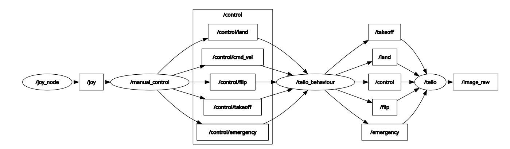
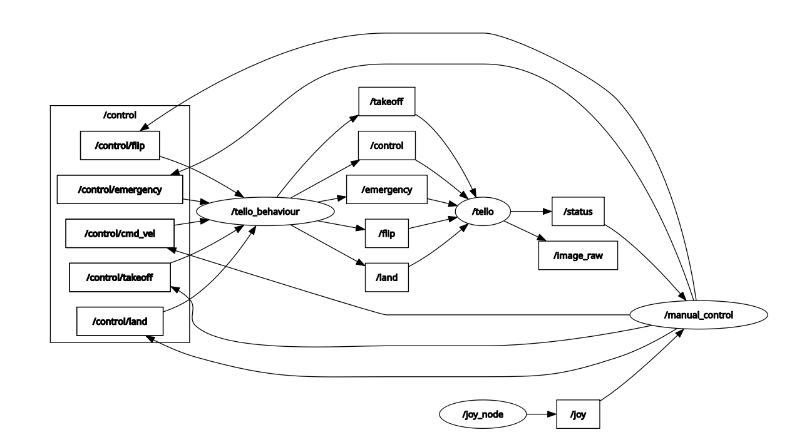
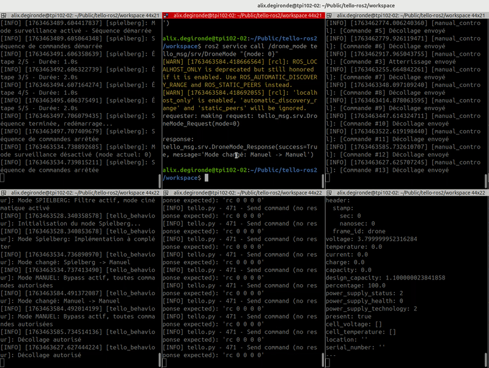

# Rapport de Projet : Pilotage et Autonomie sur Drone Tello (ROS2)

**Auteurs :** Alix DEGIRONDE & Mathis DELORME  
**Cadre :** TP Robotique Mobile & ROS2  
**Date :** Novembre 2025

---

## Table des Matières

1. [Introduction](#1-introduction)
2. [Installation et Prise en main](#2-installation-et-prise-en-main)
3. [Architecture de Contrôle](#3-architecture-de-contrôle-cœur-du-projet)
4. [Perception et Vision (QR Code)](#4-perception-et-vision-qr-code)
5. [Scénarios et Modes de Vol](#5-scénarios-et-modes-de-vol)
6. [Services et Actions ROS2 Personnalisés](#6-services-et-actions-ros2-personnalisés)
7. [Implémentation Technique](#7-implémentation-technique)
8. [Démonstrations](#8-démonstrations)
9. [Conclusion](#9-conclusion)

---

## 1. Introduction

Ce projet vise à développer une architecture logicielle complète sous **ROS2** pour contrôler un drone **DJI Tello EDU**. L'objectif est de maîtriser la chaîne complète : de l'installation des drivers à la réalisation de scénarios autonomes basés sur la vision par ordinateur (lecture de QR Codes), en passant par la gestion d'états et la sécurité.

### 1.1 Contexte et Objectifs

Le drone DJI Tello EDU est une plateforme idéale pour l'apprentissage de la robotique aérienne. Ce projet s'articule autour de trois axes principaux :

- **Maîtrise de ROS2** : Communication inter-nœuds, services, actions
- **Vision par ordinateur** : Détection et suivi de QR codes avec OpenCV
- **Autonomie** : Gestion de modes automatiques et scénarios complexes

### 1.2 Théorie : Mécanique du vol d'un quadrirotor

Pour contrôler la trajectoire d'un quadrirotor, on agit sur la vitesse de rotation des 4 hélices pour créer des différentiels de poussée. Voici les 4 commandes classiques :

1. **Gaz (Throttle) :** Monter/Descendre. On augmente ou diminue la vitesse des 4 moteurs simultanément pour créer une variation de poussée verticale.

2. **Lacet (Yaw) :** Rotation sur soi-même autour de l'axe Z. On accélère les moteurs tournant dans un sens (horaire) et on ralentit les autres pour créer un couple de rotation.

3. **Tangage (Pitch) :** Avancer/Reculer. On accélère les moteurs arrière et ralentit les moteurs avant, créant une inclinaison du drone vers l'avant ou l'arrière.

4. **Roulis (Roll) :** Déplacement latéral gauche/droite. On accélère les moteurs d'un côté et ralentit ceux de l'autre pour incliner le drone latéralement.

Ces commandes sont combinées pour obtenir des trajectoires complexes dans l'espace 3D.

---

## 2. Installation et Prise en main

### 2.1 Configuration de l'environnement

Nous avons mis en place un workspace ROS2 complet avec la structure suivante :

```
tello/
├── workspace/
│   ├── src/
│   │   ├── controller/        # Notre package principal (développé)
│   │   ├── tello/             # Driver Tello
│   │   ├── tello_control/     # Contrôle manuel
│   │   └── tello_msg/         # Messages et services personnalisés
│   ├── build/
│   ├── install/
│   └── log/
└── scripts/                   # Scripts de lancement
```

Les dépendances Python ont été gérées via un environnement virtuel (`venv`) incluant :
- `rclpy` (ROS2 Python)
- `opencv-python` (vision)
- `cv_bridge` (conversion ROS ↔ OpenCV)
- `pyzbar` (lecture QR codes)

> **Observation importante** : Le dépôt cloné ne suivait pas exactement la structure standard ROS2. Nous avons dû adapter le placement des fichiers `setup.py` et réorganiser les dossiers `src` pour respecter les conventions de `colcon build`.

### 2.2 Analyse des Topics ROS2

Après lancement du driver Tello, voici les principaux topics identifiés :

| Topic | Type de message | Description | Fréquence |
| :--- | :--- | :--- | :--- |
| `/control` | `geometry_msgs/Twist` | Commande de vitesse 3D + rotation | ~20 Hz |
| `/image_raw` | `sensor_msgs/Image` | Flux vidéo caméra frontale | 30 FPS |
| `/status` | `tello_msgs/TelloStatus` | Batterie, altitude, temps de vol | 10 Hz |
| `/odom` | `nav_msgs/Odometry` | Estimation position/orientation | 20 Hz |
| `/takeoff` | `std_msgs/Empty` | Commande de décollage | Event |
| `/land` | `std_msgs/Empty` | Commande d'atterrissage | Event |
| `/emergency` | `std_msgs/Empty` | Arrêt d'urgence | Event |

### 2.3 Visualisation et Validation

Nous avons utilisé **RViz2** et **rqt** pour valider le bon fonctionnement du système :



*Figure 1 : Interface rqt_graph montrant l'architecture complète des nœuds ROS2*



*Figure 2 : Monitoring en temps réel des données de télémétrie (batterie, altitude, vitesse)*

**Affichage de l'altitude mesurée :**  
Le topic `/status` contient un champ `distance_tof` (Time-of-Flight sensor) qui fournit l'altitude précise du drone en centimètres. Ce capteur est crucial pour le vol stationnaire et les manœuvres automatiques.

```bash
# Visualiser l'altitude en temps réel
ros2 topic echo /status
```

### 2.4 Organisation Non-Standard du Workspace

> **❓ Question importante du TP :** L'organisation du dossier cloné ne semble pas correspondre à ce que les standards ROS2 imposent... À moins que ?

**Explication :**  
La bonne pratique ROS2 veut qu'on clone uniquement un **package** dans le `/src` de notre workspace. Or, dans ce cas, le clone du git contient **tout un projet**, avec notamment un workspace complet.

**Notre approche :**  
Nous avons donc travaillé directement dans le workspace fourni (`tello/workspace`) au lieu de créer un nouveau workspace. Cette organisation, bien que non conventionnelle, est justifiée car :

- Le projet fournit plusieurs packages interdépendants (`controller`, `tello`, `tello_control`, `tello_msg`)
- La structure facilite le partage d'un environnement complet et fonctionnel
- Les dépendances et configurations sont déjà intégrées

---

## 3. Architecture de Contrôle (Cœur du projet)

Pour gérer la complexité des différents modes (Manuel, Automatique, Urgence), nous avons fait évoluer l'architecture simple vers une **architecture centralisée avec filtrage intelligent**.

### 3.1 Évolution du Graphe ROS2

**Architecture initiale** (simple mais non sécurisée) :

```
[Joystick] → [manual_control] → [/control] → [Tello Driver] → [Drone]
```

**Architecture finale** (avec nœud de comportement) :

```
[Joystick] → [manual_control] → [/control/*] → [tello_behaviour] → [/control, /takeoff, /land] → [Drone]
                                                       ↑
                                              [Service /drone_mode]
                                                       ↓
                                    [Modes: surveillance, spielberg, qr_follower]
```

### 3.2 Le nœud `tello_behaviour` : Multiplexeur intelligent

Le nœud **`tello_behaviour`** est le cerveau du système. Il agit comme un **multiplexeur de commandes** avec filtrage selon le mode actif.

**Fonctionnalités clés :**

- **Gestion de 4 modes de vol** : Manuel, QR Follower, Spielberg, Surveillance
- **Filtrage sélectif** : En mode automatique, seuls les commandes critiques (emergency, takeoff, land) du joystick passent
- **Service ROS2** : Changement de mode à la volée via `/drone_mode`
- **Sécurité** : Prévention des conflits entre commandes manuelles et automatiques

### 3.3 Système de Topics hiérarchique

Nous avons organisé les topics pour distinguer les sources de commande :

**Topics du contrôle manuel** (filtrés par `tello_behaviour`) :

- `/control/takeoff` → Décollage manuel
- `/control/land` → Atterrissage manuel  
- `/control/emergency` → Arrêt d'urgence (toujours prioritaire)
- `/control/cmd_vel` → Mouvements joystick (bloqués en mode auto)
- `/control/flip` → Figures acrobatiques (mode manuel uniquement)

**Topics vers le drone** (après filtrage) :

- `/takeoff`, `/land`, `/emergency`, `/control`

> **❓ Question du TP :** Vous remarquerez que le topic sortant de `manual_control` a changé. Comment avons-nous procédé ? Quel est l'intérêt ? Pourquoi effectuer le changement en sortie de joy est intéressant plutôt qu'ailleurs ?

**Réponse - Stratégie de Remapping :**

Nous avons renommé les topics de sortie de `manual_control` pour ajouter le préfixe `/control/*`. Cette technique s'appelle le **remapping** de topics.

**Méthode :**  
Dans le code de `manual_control.py`, nous publions sur des topics préfixés :

```python
self.pub_takeoff = self.create_publisher(Empty, '/control/takeoff', 10)
self.pub_land = self.create_publisher(Empty, '/control/land', 10)
self.pub_cmd_vel = self.create_publisher(Twist, '/control/cmd_vel', 10)
```

**Intérêts majeurs :**

1. **Séparation des responsabilités** : Les commandes "brutes" du joystick (`/control/*`) sont distinctes des commandes "validées" vers le drone (`/takeoff`, `/land`, etc.)

2. **Point d'interception unique** : Le nœud `tello_behaviour` peut s'abonner à tous les `/control/*` et décider de les relayer ou non selon le mode actif

3. **Sécurité** : Évite qu'un nœud malveillant ou buggé publie directement sur `/takeoff` sans passer par le filtre de sécurité

4. **Traçabilité** : On sait immédiatement d'où vient une commande (joystick vs mode automatique)

5. **Flexibilité** : Facile d'ajouter d'autres sources de commandes (clavier, API web, etc.) qui publieraient aussi sur `/control/*`

**Pourquoi après `joy` plutôt qu'ailleurs ?**  
Le nœud `joy` publie des données brutes de joystick (`sensor_msgs/Joy`). C'est `manual_control` qui **interprète** ces données et les convertit en commandes sémantiques (Twist, Empty). Effectuer le remapping à cette étape est logique car :
- On a déjà des messages typés et compréhensibles
- On peut appliquer des transformations (dead zones, scaling)
- On conserve la flexibilité de changer la source d'entrée (autre joystick, clavier)

Cette séparation permet au `tello_behaviour` de décider quelle source de commande est autorisée selon le contexte.

---

## 4. Perception et Vision (QR Code)

Nous utilisons la caméra embarquée (720p, 30 FPS) pour détecter et interpréter des QR codes comme système de waypoints visuels.

### 4.1 Chaîne de traitement

```
[/image_raw] → [cv_bridge] → [OpenCV Image] → [QRCodeDetector] → [Position & Data] → [Commandes Twist]
```

**Technologies utilisées :**

- `cv_bridge` : Conversion ROS Image ↔ OpenCV
- `cv2.QRCodeDetector()` : Détection native OpenCV (rapide, pas besoin de bibliothèques externes)
- Calcul de position 2D basé sur la bounding box du QR code

### 4.2 Mode "QR Follower" : Asservissement visuel

Le nœud `qr_code_follower.py` implémente un **contrôleur visuel proportionnel** pour maintenir le QR code au centre de l'image.

**Algorithme de contrôle :**

```python
# 1. Détection du QR code et calcul du centre
qr_center_x, qr_center_y = get_qr_center(bbox)

# 2. Calcul de l'erreur par rapport au centre de l'image
error_x = qr_center_x - (img_width / 2)
error_y = qr_center_y - (img_height / 2)

# 3. Génération des commandes (zones de tolérance)
if qr_center_x < center - zone/2:
    twist.linear.x = -30.0  # Déplacement gauche
elif qr_center_x > center + zone/2:
    twist.linear.x = 30.0   # Déplacement droite
```

**Zone morte (Dead Zone) :**  
Pour éviter les oscillations, nous avons défini une zone de tolérance (1/3 de l'image) autour du centre. Le drone ne bouge que si le QR code sort de cette zone.


*Figure 3 : Le drone suit automatiquement le QR code et se stabilise quand il est centré*

**Défis rencontrés :**

- **Latence WiFi** : Le flux vidéo a ~200ms de délai, nécessitant des gains conservateurs
- **Stabilité** : Sans zone morte, le drone oscillait continuellement
- **Luminosité** : La détection OpenCV est sensible aux conditions d'éclairage

---

## 5. Scénarios et Modes de Vol

Le changement de mode est géré par un **Service ROS2** personnalisé (`/drone_mode`).

### 5.1 Les 4 Modes de vol

| Mode | ID | Description | Commandes autorisées |
|------|----|----|-----|
| **Manuel** | 0 | Contrôle complet au joystick | Toutes |
| **QR Follower** | 1 | Suivi automatique de QR code | Takeoff, Land, Emergency |
| **Spielberg** | 2 | Travelling cinématique fluide | Takeoff, Land, Emergency |
| **Surveillance** | 3 | Rotation panoramique continue | Takeoff, Land, Emergency |

### 5.2 Mode Manuel

Mode par défaut. Le pilote a un contrôle total via le joystick Xbox :

**Mappage des boutons :**

- **Stick Gauche** : Gaz (haut/bas) + Lacet (rotation)
- **Stick Droit** : Tangage (avant/arrière) + Roulis (gauche/droite)
- **Bouton Y** : Décollage
- **Bouton A** : Atterrissage
- **Bouton B** : Arrêt d'urgence
- **Bouton X** : Flip avant

### 5.3 Mode Surveillance

Ce mode fait tourner le drone sur lui-même pour effectuer une surveillance panoramique.

**Implémentation :**

```python
class Surveillance(Node):
    def __init__(self):
        # Timer à 20 Hz pour commandes fluides
        self.timer = self.create_timer(0.05, self.timer_callback)
        
        # Service pour activer/désactiver
        self.surveillance_service = self.create_service(
            SurveillanceSrv,
            '/surveillance/control',
            self.handle_surveillance_request
        )
    
    def timer_callback(self):
        if self.is_active:
            twist = Twist()
            twist.angular.z = 100.0  # Rotation continue
            self.cmd_vel_pub.publish(twist)
```


*Figure 4 : Mode surveillance - Le drone effectue une rotation panoramique continue à vitesse constante*

**Cas d'usage :** Scan de zone, détection d'intrus, prise de vue 360°

### 5.4 Mode "Spielberg" : Action Server pour mouvements complexes

Le mode Spielberg réalise un **travelling cinématique** avec plusieurs étapes. Nous avons choisi d'utiliser un **Action Server** plutôt qu'un simple Service.

**Pourquoi une Action plutôt qu'un Service ?**

| Critère | Service | Action |
|---------|---------|--------|
| Durée | Bloquant, réponse immédiate | Non-bloquant, longue durée |
| Feedback | Non | Oui (progression) |
| Annulation | Non | Oui (cancel possible) |
| Use case | Commandes instantanées | Trajectoires complexes |

**Structure de l'Action Spielberg :**

```python
# Définition dans tello_msg/action/Spielberg.action
# Goal
bool start

---
# Result
bool success
string message

---
# Feedback
int32 current_step
int32 total_steps
float32 elapsed_time
```

**Séquence d'exécution :**

1. **Étape 1/3** : Avancement (twist.linear.y = 50.0) pendant 2s
2. **Étape 2/3** : Rotation caméra (twist.angular.z = 40.0) pendant 1s
3. **Étape 3/3** : Recul (twist.linear.y = -50.0) pendant 2s
4. Arrêt et publication du résultat

**Gestion de l'annulation :**

```python
def execute_callback(self, goal_handle):
    # Après chaque étape, vérifier l'annulation
    if goal_handle.is_cancel_requested:
        self.send_stop_command()
        goal_handle.canceled()
        result.success = False
        result.message = "Séquence annulée"
        return result
```


*Figure 5 : Logs du mode Spielberg montrant les étapes et le feedback temps réel*


*Figure 6 : Vue embarquée pendant la séquence cinématique Spielberg*



*Figure 7 : Travelling Spielberg complet (avance, rotation, recul)*

---

## 6. Services et Actions ROS2 Personnalisés

### 6.1 Architecture de Communication

Notre système utilise deux paradigmes de communication ROS2 :

- **Services** : Communication synchrone requête-réponse pour les changements d'état
- **Actions** : Communication asynchrone avec feedback pour les tâches longues durée

### 6.2 Service `/drone_mode` : Gestion des Modes

**Type :** `tello_msg/srv/DroneMode`

**Définition (`DroneMode.srv`) :**

```
# Service pour changer le mode du drone
# Modes:
# 0 = Manuel
# 1 = QR Code Follower
# 2 = Spielberg
# 3 = Surveillance

int32 mode
---
bool success
string message
```

**Utilisation pratique :**

```bash
# Passer en mode Manuel
ros2 service call /drone_mode tello_msg/srv/DroneMode "{mode: 0}"

# Passer en mode QR Follower
ros2 service call /drone_mode tello_msg/srv/DroneMode "{mode: 1}"

# Passer en mode Spielberg
ros2 service call /drone_mode tello_msg/srv/DroneMode "{mode: 2}"

# Passer en mode Surveillance
ros2 service call /drone_mode tello_msg/srv/DroneMode "{mode: 3}"
```

**Implémentation côté serveur (`tello_behaviour.py`) :**

```python
def handle_mode_change(self, request, response):
    """Gère les demandes de changement de mode"""
    requested_mode = request.mode
    
    # Validation du mode
    if requested_mode not in [0, 1, 2, 3]:
        response.success = False
        response.message = f"Mode invalide: {requested_mode}"
        return response
    
    # Arrêter le mode actuel
    old_mode = self.current_mode
    if old_mode == DroneModes.SURVEILLANCE:
        self.stop_surveillance_mode()
    if old_mode == DroneModes.SPIELBERG:
        self.stop_spielberg_mode()
    
    # Activer le nouveau mode
    self.current_mode = requested_mode
    response.success = True
    response.message = f"Mode changé: {old_mode} -> {requested_mode}"
    
    return response
```

**Retour console typique :**

```
[INFO] [tello_behaviour]: Mode changé: Manuel -> Spielberg
[INFO] [tello_behaviour]: Mode SPIELBERG: Filtre actif, mode cinématique activé
[INFO] [tello_behaviour]: Initialisation du mode Spielberg...
[INFO] [tello_behaviour]: Envoi du goal Spielberg...
```

### 6.3 Service `/surveillance/control` : Activation Surveillance

**Type :** `tello_msg/srv/Surveillance`

**Définition (`Surveillance.srv`) :**

```
bool data    # true = activer, false = désactiver
---
bool success
```

**Utilisation :**

```bash
# Activer la surveillance
ros2 service call /surveillance/control tello_msg/srv/Surveillance "{data: true}"

# Désactiver la surveillance
ros2 service call /surveillance/control tello_msg/srv/Surveillance "{data: false}"
```

**Implémentation (`surveillance.py`) :**

```python
def handle_surveillance_request(self, request, response):
    """Gère les demandes d'activation/désactivation"""
    old_state = self.is_active
    self.is_active = request.data
    
    if old_state != self.is_active:
        if self.is_active:
            self.get_logger().info('Mode surveillance ACTIVÉ')
        else:
            self.get_logger().info('Mode surveillance DÉSACTIVÉ')
            self.send_stop_command()  # Arrêter la rotation
    
    response.success = True
    return response
```

### 6.4 Action `spielberg` : Séquence Cinématique

**Type :** `tello_msg/action/Spielberg`

**Définition (`Spielberg.action`) :**

```
# Goal - Démarrer la séquence
bool start
---
# Result - Résultat final
bool success
string message
---
# Feedback - Progression en temps réel
int32 current_step
int32 total_steps
float32 elapsed_time
```

**Architecture Action Server/Client :**

```
[tello_behaviour] ──(Action Client)──> [spielberg] ──(Action Server)──> [Séquence]
                                            │
                                            ├─> Goal accepté
                                            ├─> Feedback (étape 1/3)
                                            ├─> Feedback (étape 2/3)
                                            ├─> Feedback (étape 3/3)
                                            └─> Result (succès)
```

**Utilisation programmatique (dans `tello_behaviour.py`) :**

```python
# Création du client d'action
self._spielberg_action_client = ActionClient(
    self, 
    Spielberg, 
    'spielberg'
)

# Envoi du goal
def start_spielberg_mode(self):
    goal_msg = Spielberg.Goal()
    goal_msg.start = True
    
    send_goal_future = self._spielberg_action_client.send_goal_async(
        goal_msg,
        feedback_callback=self.spielberg_feedback_callback
    )

# Réception du feedback
def spielberg_feedback_callback(self, feedback_msg):
    feedback = feedback_msg.feedback
    self.get_logger().info(
        f'Spielberg - Étape {feedback.current_step}/{feedback.total_steps} '
        f'(temps: {feedback.elapsed_time:.1f}s)'
    )

# Annulation possible
def stop_spielberg_mode(self):
    if self._spielberg_goal_handle is not None:
        cancel_future = self._spielberg_goal_handle.cancel_goal_async()
```

**Utilisation via ligne de commande :**

```bash
# Envoyer un goal
ros2 action send_goal /spielberg tello_msg/action/Spielberg "{start: true}"

# Annuler l'action en cours
ros2 action send_goal /spielberg tello_msg/action/Spielberg "{start: true}" --feedback
# Puis Ctrl+C pour annuler

# Lister les actions disponibles
ros2 action list

# Obtenir des infos sur l'action
ros2 action info /spielberg
```

**Logs d'exécution typiques :**

```
[INFO] [spielberg]: Goal Spielberg accepté - Séquence démarrée
[INFO] [spielberg]: [Étape 1/3] Avancement...
[INFO] [tello_behaviour]: Spielberg - Étape 1/3 (temps: 0.0s)
[INFO] [spielberg]: [Étape 2/3] Rotation caméra...
[INFO] [tello_behaviour]: Spielberg - Étape 2/3 (temps: 2.1s)
[INFO] [spielberg]: [Étape 3/3] Recul...
[INFO] [tello_behaviour]: Spielberg - Étape 3/3 (temps: 3.2s)
[INFO] [spielberg]: ✓ Séquence Spielberg terminée: complétée en 5.3s
[INFO] [tello_behaviour]: ✓ Séquence Spielberg terminée: Séquence complétée
```

### 6.5 Comparaison Services vs Actions

| Caractéristique | Service `/drone_mode` | Action `spielberg` |
|-----------------|----------------------|-------------------|
| **Durée** | Instantané (<100ms) | Longue (5s+) |
| **Feedback** | ❌ Non | ✅ Oui (progression) |
| **Annulation** | ❌ Non pertinent | ✅ Oui (cancel_goal) |
| **Blocage** | Bloquant | Non-bloquant |
| **Use case** | Changement d'état | Trajectoire complexe |
| **Pattern** | Requête → Réponse | Goal → Feedback* → Result |

### 6.6 Topics ROS2 du Système

**Topics de contrôle manuel (avant filtrage) :**

| Topic | Type | Fréquence | Description |
|-------|------|-----------|-------------|
| `/control/cmd_vel` | `Twist` | 20 Hz | Commandes mouvement joystick |
| `/control/takeoff` | `Empty` | Event | Décollage manuel |
| `/control/land` | `Empty` | Event | Atterrissage manuel |
| `/control/emergency` | `Empty` | Event | Arrêt d'urgence |
| `/control/flip` | `String` | Event | Flip acrobatique |

**Topics vers le drone (après filtrage) :**

| Topic | Type | Fréquence | Description |
|-------|------|-----------|-------------|
| `/control` | `Twist` | 20 Hz | Commandes finales vers Tello |
| `/takeoff` | `Empty` | Event | Décollage effectif |
| `/land` | `Empty` | Event | Atterrissage effectif |
| `/emergency` | `Empty` | Event | Arrêt effectif |

**Topics de retour drone :**

| Topic | Type | Fréquence | Description |
|-------|------|-----------|-------------|
| `/image_raw` | `Image` | 30 FPS | Flux vidéo caméra |
| `/status` | `TelloStatus` | 10 Hz | Batterie, altitude, température |
| `/odom` | `Odometry` | 20 Hz | Position et orientation estimées |
| `/imu` | `Imu` | 50 Hz | Accéléromètre + gyroscope |

**Topics internes (communication inter-nœuds) :**

| Topic | Type | Fréquence | Description |
|-------|------|-----------|-------------|
| `/drone_mode/state` | `Int32` | On change | Notification changement de mode |
| `/surveillance/cmd_vel` | `Twist` | 20 Hz | Commandes mode surveillance |

### 6.7 Workflow de Communication Complet

**Exemple : Passage en mode Spielberg**

```
1. Utilisateur : ros2 service call /drone_mode "{mode: 2}"
         ↓
2. [tello_behaviour] : Reçoit requête DroneMode
         ↓
3. [tello_behaviour] : Arrête mode actuel (si nécessaire)
         ↓
4. [tello_behaviour] : Change current_mode = SPIELBERG
         ↓
5. [tello_behaviour] : Envoie Goal à Action Server spielberg
         ↓
6. [spielberg] : Accepte le Goal
         ↓
7. [spielberg] : Exécute séquence (avance → rotation → recul)
         │
         ├─> Feedback après chaque étape
         │   (reçu par tello_behaviour et loggé)
         │
8. [spielberg] : Publie Result (success=true)
         ↓
9. [tello_behaviour] : Reçoit Result et affiche confirmation
```

---

## 7. Implémentation Technique

### 7.1 Structure du Package `controller`

Notre package principal contient 6 nœuds ROS2 :

```
controller/
├── controller/
│   ├── __init__.py
│   ├── manual_control.py          # Pilotage joystick
│   ├── tello_behaviour.py         # Multiplexeur de modes
│   ├── qr_code_follower.py        # Suivi de QR code
│   ├── qr_code_reader.py          # Lecteur QR simple
│   ├── spielberg.py               # Action server cinématique
│   └── surveillance.py            # Mode surveillance
├── srv/
│   ├── Mode.srv                   # Service changement de mode
│   └── Surveillance.srv           # Service surveillance
├── setup.py
└── package.xml
```

**Entry points dans `setup.py` :**

```python
entry_points={
    'console_scripts': [
        'manual_control = controller.manual_control:main',
        'tello_behaviour = controller.tello_behaviour:main',
        'spielberg = controller.spielberg:main',
        'surveillance = controller.surveillance:main',
        'qr_code_follower = controller.qr_code_follower:main',
        'qr_code_reader = controller.qr_code_reader:main'
    ],
}
```

### 7.2 Architecture Complète des Packages

Le workspace contient 4 packages principaux :

**1. Package `controller` (Python)**
- **Rôle** : Logique de contrôle manuel et modes automatiques, filtrage des commandes
- **Langage** : Python 3
- **Nœuds** : 6 nœuds (manual_control, tello_behaviour, spielberg, surveillance, qr_code_follower, qr_code_reader)
- **Dépendances** : rclpy, geometry_msgs, sensor_msgs, cv_bridge, opencv-python

**2. Package `tello` (Python)**
- **Rôle** : Driver matériel, interface avec la bibliothèque `djitellopy`, gestion de la connexion WiFi au drone
- **Langage** : Python 3
- **Nœud principal** : `tello` (node.py)
- **Publications** :
  - `/image_raw` : sensor_msgs/Image (flux vidéo 30 FPS)
  - `/camera_info` : sensor_msgs/CameraInfo
  - `/status` : tello_msg/TelloStatus (batterie, altitude, température)
  - `/imu` : sensor_msgs/Imu (accéléromètre, gyroscope)
  - `/odom` : nav_msgs/Odometry
  - `/battery` : sensor_msgs/BatteryState
- **Souscriptions** :
  - `/takeoff`, `/land`, `/emergency` : std_msgs/Empty
  - `/control` : geometry_msgs/Twist
  - `/flip` : std_msgs/String
  - `/wifi_config` : tello_msg/TelloWifiConfig

**3. Package `tello_control` (C++)**
- **Rôle** : Alternative de contrôle via clavier (sans joystick)
- **Langage** : C++ avec OpenCV
- **Fichier principal** : `main.cpp`
- **Interface** : Contrôle clavier avec affichage OpenCV
- **Publications** : `/takeoff`, `/land`, `/emergency`, `/flip`, `/control`
- **Utilisation** : Alternative légère pour tests rapides sans matériel joystick

**4. Package `tello_msg` (Messages/Services personnalisés)**
- **Rôle** : Définitions de messages et services custom pour le projet
- **Types définis** :
  - **Messages** : `TelloStatus.msg`, `TelloID.msg`, `TelloWifiConfig.msg`
  - **Services** : `DroneMode.srv`, `Surveillance.srv`
  - **Actions** : `Spielberg.action`

**Flux de communication inter-packages :**

```
[Joy Node] → [controller::manual_control] → [controller::tello_behaviour]
                                                       ↓
                                            [tello::tello_driver]
                                                       ↓
                                                  [Drone Tello]
```

Alternative sans joystick :
```
[Keyboard] → [tello_control::TelloControl] → [tello::tello_driver] → [Drone Tello]
```

### 7.3 Services et Actions personnalisés

**Package `tello_msg` :**

```
tello_msg/
├── srv/
│   ├── DroneMode.srv              # Changement de mode
│   └── Surveillance.srv           # Activation surveillance
└── action/
    └── Spielberg.action           # Action cinématique
```

**Définition du service `DroneMode.srv` :**

```
# Request
int32 mode

---
# Response
bool success
string message
```

**Utilisation :**

```bash
# Passer en mode Spielberg (ID=2)
ros2 service call /drone_mode tello_msg/srv/DroneMode "{mode: 2}"
```

### 6.3 Workflow de développement

**Commandes de compilation :**

```bash
cd tello/workspace
colcon build --packages-select controller tello_msg
source install/setup.bash
```

**Lancement du système complet :**

```bash
# Terminal 1 : Driver Tello
ros2 run tello_driver tello_driver_main

# Terminal 2 : Comportement
ros2 run controller tello_behaviour

# Terminal 3 : Contrôle manuel
ros2 run controller manual_control

# Terminal 4 : Modes automatiques (selon besoin)
ros2 run controller spielberg
ros2 run controller surveillance
ros2 run controller qr_code_follower
```

---

## 8. Démonstrations

### 8.1 Commandes de Lancement Complètes

**Méthode 1 : Lancement automatique avec launch file**

```bash
cd tello/workspace
source install/setup.bash
ros2 launch controller tello.launch.py
```

Ce fichier launch démarre automatiquement :

- Le driver Tello
- Le nœud de comportement (`tello_behaviour`)
- Le contrôle manuel (`manual_control`)
- Le nœud joy pour la manette
- Tous les nœuds de modes (spielberg, surveillance, qr_follower)

**Méthode 2 : Lancement manuel (pour debug)**

```bash
# Terminal 1 : Driver Tello
cd tello/workspace
source install/setup.bash
ros2 run tello tello

# Terminal 2 : Nœud Joy (manette)
ros2 run joy joy_node

# Terminal 3 : Comportement
ros2 run controller tello_behaviour

# Terminal 4 : Contrôle manuel
ros2 run controller manual_control

# Terminal 5 : Mode Spielberg
ros2 run controller spielberg

# Terminal 6 : Mode Surveillance
ros2 run controller surveillance

# Terminal 7 : QR Code Follower
ros2 run controller qr_code_follower
```

**Compilation du workspace :**

```bash
cd tello/workspace
colcon build --packages-select controller tello_msg
source install/setup.bash
```

### 8.2 Tests en conditions réelles


*Figure 8 : Test du QR Follower en conditions réelles - Le drone maintient sa position centrée*


*Figure 9 : Vue embarquée pendant le travelling cinématique*

### 8.3 Scénario complet intégré

Nous avons développé un scénario autonome complet :

**Étapes :**

1. **Décollage manuel** (Bouton Y)
2. **Activation mode Surveillance** → Recherche de QR code "START"
3. **Détection QR "START"** → Passage automatique en mode Spielberg
4. **Exécution travelling** → Séquence complète
5. **Détection QR "STOP"** → Atterrissage


*Figure 10 : Enchaînement automatique : décollage → surveillance → spielberg → atterrissage*

### 8.4 Commandes de Test et Debug

**Test de décollage/atterrissage basique :**

```bash
# Décollage
ros2 topic pub /takeoff std_msgs/msg/Empty {} --once

# Attendre quelques secondes...

# Atterrissage
ros2 topic pub /land std_msgs/msg/Empty {} --once
```

**Vérification de la manette :**

```bash
# Vérifier que le topic /joy existe
ros2 topic list | grep joy

# Voir les données en temps réel
ros2 topic echo /joy

# Info sur le topic
ros2 topic info /joy
```

**Changement de modes :**

```bash
# Mode Manuel (0)
ros2 service call /drone_mode tello_msg/srv/DroneMode "{mode: 0}"

# Mode QR Follower (1)
ros2 service call /drone_mode tello_msg/srv/DroneMode "{mode: 1}"

# Mode Spielberg (2)
ros2 service call /drone_mode tello_msg/srv/DroneMode "{mode: 2}"

# Mode Surveillance (3)
ros2 service call /drone_mode tello_msg/srv/DroneMode "{mode: 3}"
```

**Monitoring des topics importants :**

```bash
# Voir les commandes envoyées au drone
ros2 topic echo /control

# Voir le statut du drone
ros2 topic echo /status

# Voir l'odométrie
ros2 topic echo /odom

# Voir le niveau de batterie
ros2 topic echo /battery
```

**Visualisation du graphe ROS2 :**

```bash
# Graphe des nœuds et topics
ros2 run rqt_graph rqt_graph

# Interface rqt complète
rqt
```

### 8.5 Logs Console Typiques

**Logs de démarrage du système :**

```
[INFO] [tello.py]: Send command: 'command'
[INFO] [tello.py]: Response command: 'ok'
[INFO] [tello.py]: Send command: 'wifi?'
[INFO] [tello.py]: Response wifi?: '90'
[INFO] [tello_behaviour]: Noeud tello_behaviour initialisé en mode: Manuel
[INFO] [tello_behaviour]: Service '/drone_mode' disponible pour changer de mode
[INFO] [manual_control]: Contrôle manuel initialisé - En attente du joystick
[INFO] [spielberg_action_server]: Noeud spielberg_action_server initialisé
[INFO] [spielberg_action_server]: Action server 'spielberg' disponible
[INFO] [surveillance]: noeud surveillance initialisé
[INFO] [qr_code_follower]: QR Follower initialisé
```

**Logs d'un décollage réussi :**

```
[INFO] [tello_behaviour]: Décollage autorisé
[INFO] [tello.py]: Send command: 'takeoff'
[INFO] [tello.py]: Response takeoff: 'ok'
[INFO] [tello.py]: Send command (no response expected): 'rc 0 0 0 0'
```

**Logs du changement de mode :**

```
[INFO] [tello_behaviour]: Mode changé: Manuel -> Spielberg
[INFO] [tello_behaviour]: Mode SPIELBERG: Filtre actif, mode cinématique activé
[INFO] [tello_behaviour]: Initialisation du mode Spielberg...
[INFO] [tello_behaviour]: Envoi du goal Spielberg...
[INFO] [spielberg_action_server]: Réception d'un goal Spielberg...
[INFO] [spielberg_action_server]: Exécution de la séquence Spielberg...
[INFO] [spielberg_action_server]: [Étape 1/3] Avancement...
[INFO] [tello_behaviour]: Spielberg - Étape 1/3 (temps écoulé: 0.0s)
[INFO] [spielberg_action_server]: [Étape 2/3] Rotation caméra...
[INFO] [tello_behaviour]: Spielberg - Étape 2/3 (temps écoulé: 2.1s)
[INFO] [spielberg_action_server]: [Étape 3/3] Recul...
[INFO] [tello_behaviour]: Spielberg - Étape 3/3 (temps écoulé: 3.2s)
[INFO] [spielberg_action_server]: ✓ Séquence Spielberg complétée en 5.3s
[INFO] [tello_behaviour]: ✓ Séquence Spielberg terminée: Séquence complétée en 5.3s
```

---

## 9. Conclusion

### 9.1 Bilan technique

Ce projet nous a permis de maîtriser :

**Concepts ROS2 avancés :**

- ✅ Services personnalisés pour communication synchrone (DroneMode, Surveillance)
- ✅ Action Servers pour tâches longues avec feedback (Spielberg)
- ✅ Architecture modulaire multi-nœuds (6 nœuds développés)
- ✅ Gestion d'états avec machine à modes (4 modes de vol)
- ✅ Communication inter-nœuds via topics hiérarchiques

**Vision par ordinateur :**

- ✅ Intégration OpenCV avec ROS2 via cv_bridge
- ✅ Détection temps réel de QR codes (30 FPS)
- ✅ Asservissement visuel avec zone morte
- ✅ Traitement d'image embarqué sur flux vidéo WiFi

**Robotique aérienne :**

- ✅ Commande Twist (6 DOF)
- ✅ Gestion de la sécurité (arrêt d'urgence prioritaire)
- ✅ Filtrage de commandes concurrentes
- ✅ Télémétrie temps réel (batterie, altitude, IMU)

**Architecture logicielle :**

- ✅ Pattern Multiplexeur pour arbitrage de commandes
- ✅ Séparation des responsabilités (1 nœud = 1 fonction)
- ✅ Système de fichiers launch pour déploiement
- ✅ Services/Actions pour communication adaptée au besoin

### 9.2 Réponses aux Questions du TP

**Question 1 : Commandes classiques d'un quadrirotor**

Les quatre commandes classiques sont :

1. **Gaz (Throttle)** : Variation de la poussée verticale en modifiant la vitesse des 4 moteurs simultanément
2. **Lacet (Yaw)** : Rotation autour de l'axe Z par différentiel de vitesse entre moteurs horaires et anti-horaires
3. **Tangage (Pitch)** : Inclinaison avant/arrière par différentiel avant/arrière
4. **Roulis (Roll)** : Inclinaison latérale par différentiel gauche/droite

Le contrôle se fait par action sur les vitesses des 4 hélices pour créer des différentiels de poussée.

**Question 2 : Analyse des Topics ROS2**

Topics identifiés pour la commande :

- `/control` : Commandes Twist vers le drone
- `/takeoff`, `/land`, `/emergency` : Commandes de vol
- `/flip` : Figures acrobatiques

Topics de retour d'information :

- `/image_raw` : Flux vidéo 720p @ 30 FPS
- `/status` : TelloStatus (batterie, altitude, température)
- `/odom` : Odométrie (position, orientation)
- `/imu` : Données inertielle (accéléromètre, gyroscope)
- `/battery` : Niveau de charge
- `/wifi_config` : Configuration WiFi

### 9.3 Difficultés rencontrées et solutions

**1. Latence WiFi**  
Le flux vidéo a ~200-300ms de délai, rendant l'asservissement visuel difficile.  
**Solution :** Gains conservateurs et zone morte large (1/3 de l'image).

**2. Gestion des conflits de commandes**  
Risque que plusieurs nœuds envoient des commandes simultanées.  
**Solution :** Architecture avec `tello_behaviour` comme arbitre unique + filtrage par mode.

**3. Stabilité du vol stationnaire**  
Le Tello dérive en intérieur sans GPS.  
**Solution :** Correction visuelle continue en mode QR Follower.

**4. Structure non-standard du dépôt cloné**  
Le projet initial ne suivait pas les conventions ROS2.  
**Solution :** Réorganisation de l'arborescence et adaptation des fichiers `setup.py`.

**5. Synchronisation des nœuds au démarrage**  
Certains nœuds démarraient avant que les services soient disponibles.  
**Solution :** Utilisation de `wait_for_service()` avec timeout.

### 9.4 Améliorations futures

**Vision :**

- Fusion de données IMU + vision pour meilleure stabilité
- Détection d'obstacles par analyse d'images
- SLAM visuel pour cartographie 3D

**Autonomie :**

- Planification de trajectoires avec waypoints
- Évitement d'obstacles dynamiques
- Mission multi-drones coordonnée

**Interface utilisateur :**

- Dashboard web temps réel (batterie, position, caméra)
- Commandes vocales
- Mode "Follow Me" GPS

**Architecture et robustesse :**

- Harmonisation des noms de topics (éviter le mélange absolu/relatif)
- Tests unitaires et tests d'intégration ROS2
- Gestion des edge cases :
  - Absence du driver `tello` (messages publiés mais non consommés)
  - Remapping/namespaces différents entre nœuds
  - Joystick défectueux ou messages erronés (sanity-checks sur Twist)
  - Délai/latence variable de la vidéo pour les modes vision
  - Déconnexion WiFi et reconnexion automatique

### 9.5 Ressources du projet

**Code source :**  
`tello/workspace/src/controller/`

**Documentation :**  
`tello/workspace/src/controller/MODES_README.md`

**Vidéos de démonstration :**  
Voir dossier `readme_image/` pour les GIFs

**Commandes de lancement :**

```bash
# Lancement complet avec launch file
ros2 launch controller tello.launch.py

# Compilation
cd tello/workspace
colcon build --packages-select controller tello_msg
source install/setup.bash
```

---

## Annexes

### A. Tableau récapitulatif des nœuds

| Nœud | Rôle | Topics publiés | Topics écoutés |
|------|------|----------------|----------------|
| `manual_control` | Interface joystick | `/control/*` | `/joy` |
| `tello_behaviour` | Multiplexeur | `/takeoff`, `/land`, `/control` | `/control/*`, `/drone_mode/state` |
| `spielberg` | Action server | `/control` | Action `spielberg` |
| `surveillance` | Rotation panoramique | `/control` | Service `/surveillance/control` |
| `qr_code_follower` | Suivi visuel | `/control` | `/image_raw`, `/drone_mode/state` |

### B. Commandes utiles

```bash
# Lister les services
ros2 service list

# Appeler le changement de mode
ros2 service call /drone_mode tello_msg/srv/DroneMode "{mode: 1}"

# Visualiser le graphe des nœuds
ros2 run rqt_graph rqt_graph

# Monitor les topics
ros2 topic echo /status

# Enregistrer un bag
ros2 bag record -a
```

### C. Références

- [ROS2 Documentation](https://docs.ros.org/en/humble/)
- [DJI Tello SDK](https://dl-cdn.ryzerobotics.com/downloads/Tello/Tello%20SDK%202.0%20User%20Guide.pdf)
- [OpenCV QRCodeDetector](https://docs.opencv.org/4.x/de/dc3/classcv_1_1QRCodeDetector.html)

---

**Fin du rapport - Novembre 2025**
